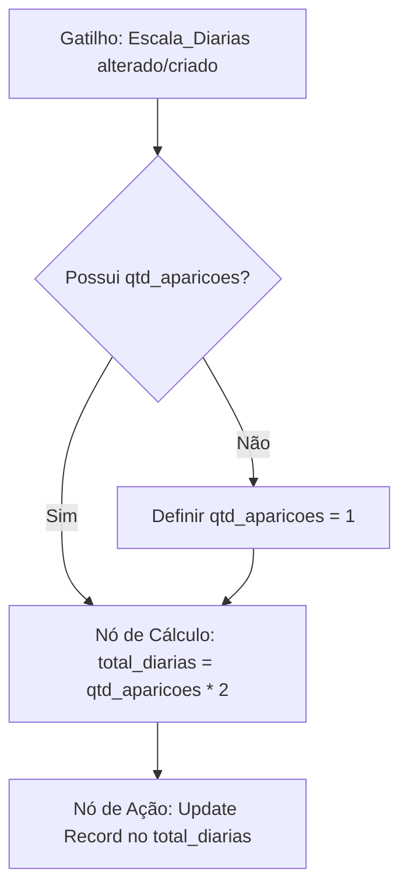
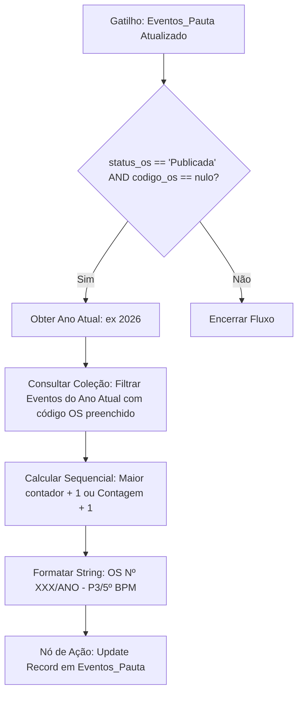

# Arquitetura do Projeto: Pauta de Eventos (P3 / 5º BPM)

Este documento descreve a especificação técnica de arquitetura, banco de dados (coleções), automações e telas para a transição da planilha de **Pauta de Eventos** da Seção de Planejamento Operacional (P3) do 5º Batalhão de Polícia Militar para a plataforma **Antigravit**.

---

## 1. Modelo de Dados (Coleções no Antigravit)

As coleções são estruturadas com seus respectivos tipos de dados, restrições e relacionamentos (Reference Fields).

### Coleção: `Eventos_Pauta`
Esta coleção armazena os dados principais do evento e o status de planejamento da Ordem de Serviço (OS).

| Nome do Campo | Identificador (API) | Tipo de Dado | Configuração / Opções | Restrições |
| :--- | :--- | :--- | :--- | :--- |
| Número do Ofício | `num_oficio` | Texto | Simples | Opcional |
| Nome do Evento | `nome_evento` | Texto | Simples | **Obrigatório** |
| Tipo de Evento | `tipo_evento` | Dropdown (Enum) | `Show`, `Futebol`, `Ato Público`, `Religioso`, `Cultural`, `Outros` | **Obrigatório** |
| Data de Início | `data_inicio` | Data | formato `YYYY-MM-DD` | **Obrigatório** |
| Data de Término | `data_termino` | Data | formato `YYYY-MM-DD` | Opcional |
| Horário de Início | `horario_inicio` | Hora | formato `HH:MM` | Opcional |
| Local/Itinerário | `local_itinerario` | Texto (Área) | Multilinha | **Obrigatório** |
| Bairro | `bairro` | Texto | Simples | Opcional |
| Status da OS | `status_os` | Dropdown (Enum) | `Pendente`, `Em Planejamento`, `Publicada`, `Executada`, `Cancelada` | Padrão: `Pendente` |
| Código OS Gerado | `codigo_os` | Texto | Simples | Somente Leitura (via Workflow) |

---

### Coleção: `Alocacao_Policiamento`
Esta coleção armazena o detalhamento do efetivo empregado e os meios logísticos (viaturas) alocados para cada evento.

| Nome do Campo | Identificador (API) | Tipo de Dado | Configuração / Opções | Restrições |
| :--- | :--- | :--- | :--- | :--- |
| Evento | `evento_id` | **Reference (Link)** | Aponta para: `Eventos_Pauta` (Relacionamento N:1) | **Obrigatório** |
| Modalidade | `modalidade` | Dropdown (Enum) | `A Pé`, `Rádio Patrulha`, `Motopatrulhamento`, `Cavalaria`, `Trânsito` | **Obrigatório** |
| Qtd. Policiais | `qtd_policiais` | Número | Inteiro (mínimo: 0) | **Obrigatório** |
| Qtd. Viaturas | `qtd_viaturas` | Número | Inteiro (mínimo: 0) | Padrão: `0` |
| Prefixos VTR | `prefixos_vtr` | Texto | Simples (Ex: "M-05102, M-05105") | Opcional |
| Comando do Serviço | `comando_servico` | Texto | Nome/Posto-Graduação do Comandante | Opcional |

---

### Coleção: `Escala_Diarias`
Esta coleção registra os policiais militares escalados para o evento e gerencia o cálculo e controle financeiro de diárias operacionais.

| Nome do Campo | Identificador (API) | Tipo de Dado | Configuração / Opções | Restrições |
| :--- | :--- | :--- | :--- | :--- |
| Evento | `evento_id` | **Reference (Link)** | Aponta para: `Eventos_Pauta` (Relacionamento N:1) | **Obrigatório** |
| Nome do Militar | `militar_nome` | Texto | Nome Completo / de Guerra | **Obrigatório** |
| Matrícula / ID | `militar_id` | Texto | Padrão de identificação da corporação | **Obrigatório** |
| Qtd. Aparições | `qtd_aparicoes` | Número | Inteiro (Escalado X vezes no mesmo evento) | **Obrigatório** (Padrão: 1) |
| Total de Diárias | `total_diarias` | Número | Calculado automaticamente por workflow | Somente Leitura |

---

## 2. Regras de Automação (Workflows)

No Antigravit, usaremos workflows baseados em gatilhos (triggers) e nós de ação (nodes).

### Fluxo 1: Automação do Cálculo de Diárias
*   **Gatilho (Trigger):** `Ao Criar Registro` (On Create) ou `Ao Atualizar Registro` (On Update) na coleção `Escala_Diarias`.
*   **Lógica:** Multiplicar a quantidade de aparições por 2.



#### Passo a passo da configuração no Editor de Workflows:
1. Crie um novo workflow chamado **"Calcular Diárias Operacionais"**.
2. Configure o nó inicial **Trigger** com o tipo `On Collection Event`. Selecione a coleção `Escala_Diarias` e os eventos `Created` e `Updated`.
3. Adicione um nó de **Condição (Filter)** para checar se o campo `qtd_aparicoes` foi alterado ou está presente.
4. Adicione um nó de **Cálculo (Formula Node)**. No editor da fórmula, utilize a seguinte sintaxe do Antigravit:
   ```javascript
   $trigger.current.qtd_aparicoes * 2
   ```
5. Conecte a um nó do tipo **Update Document (Ação)**. 
   - **Coleção:** `Escala_Diarias`
   - **ID do Registro:** `{{ $trigger.current._id }}`
   - **Campos a atualizar:** Selecione `total_diarias` e defina o valor como `{{ $formula.value }}`.
6. Salve e ative o Workflow.

---

### Fluxo 2: Gerador de Código Sequencial de OS (Ordem de Serviço)
*   **Gatilho (Trigger):** `Ao Atualizar Registro` na coleção `Eventos_Pauta`.
*   **Condição de Execução:** O `status_os` mudou para `"Publicada"` e o campo `codigo_os` está vazio (evita regravação e quebra da sequência).



#### Passo a passo da configuração no Editor de Workflows:
1. Crie um novo workflow chamado **"Gerador Sequencial de OS"**.
2. Configure o nó **Trigger** como `On Collection Event` -> Coleção `Eventos_Pauta` -> Evento `Updated`.
3. Adicione um nó de **Decisão (Conditional)** para validar as duas regras:
   - `{{ $trigger.current.status_os }} == "Publicada"`
   - `{{ $trigger.previous.status_os }} != "Publicada"`
   - `{{ $trigger.current.codigo_os }} == null` (ou vazio)
4. Adicione um nó **Script / Function Node** para determinar o ano atual e encontrar o próximo número da sequência:
   ```javascript
   // 1. Obter o ano atual da data de início do evento
   const dataInicio = new Date($trigger.current.data_inicio);
   const anoAtual = dataInicio.getFullYear() || new Date().getFullYear();
   
   // Retorna dados para o próximo nó fazer a query
   return { anoAtual };
   ```
5. Adicione um nó **Query Collection (Consulta Banco de Dados)**:
   - **Coleção:** `Eventos_Pauta`
   - **Filtro:** 
     - `data_inicio` maior ou igual a `{{ $node.Script.anoAtual }}-01-01`
     - `data_inicio` menor ou igual a `{{ $node.Script.anoAtual }}-12-31`
     - `codigo_os` diferente de vazio (not null)
   - **Ordenação:** `codigo_os` Decrescente
   - **Limite:** 1 (para pegar a última OS gerada no ano)
6. Adicione um nó de **Fórmula / Script** para calcular e formatar o número sequencial:
   ```javascript
   const ano = $node.Script.anoAtual;
   const ultimaOS = $node.QueryCollection.results[0];
   let proximoNumero = 1;
   
   if (ultimaOS && ultimaOS.codigo_os) {
       // Extrai o número do formato "OS Nº XXX/ANO - P3/5º BPM"
       // Regex busca os dígitos após "OS Nº "
       const match = ultimaOS.codigo_os.match(/OS Nº (\d+)\//);
       if (match) {
           proximoNumero = parseInt(match[1], 10) + 1;
       }
   }
   
   // Formata com 3 dígitos (ex: 001, 012, 105)
   const sequencialFormatado = String(proximoNumero).padStart(3, '0');
   const codigoFinal = `OS Nº ${sequencialFormatado}/${ano} - P3/5º BPM`;
   
   return { codigoFinal };
   ```
7. Conecte ao nó **Update Document (Ação)**:
   - **Coleção:** `Eventos_Pauta`
   - **ID do Registro:** `{{ $trigger.current._id }}`
   - **Campos a atualizar:** `codigo_os` = `{{ $node.Formatador.codigoFinal }}`.
8. Salve e ative o Workflow.

---

## 3. Interface de Usuário (Componentes e Layouts)

### Tela 1: Dashboard Operacional
Esta tela fornece uma visão rápida e controle visual da pauta de eventos do batalhão.

*   **Layout:** Grid Responsivo (2 colunas em telas grandes, 1 coluna em dispositivos móveis).
*   **Estrutura de Componentes:**

```
+-----------------------------------------------------------------------+
|  [ Card: Eventos na Semana ] (Métrica Principal - Ex: "12 Eventos")    |
+------------------------------------------------------+----------------+
|  [ Componente: Calendário Operacional ]               | [ Kanban OS ]  |
|  Exibe a pauta mensalmente baseado em 'data_inicio'  | Colunas de     |
|  e 'horario_inicio'. Cores por tipo de evento.       | Status de OS.  |
|                                                      | Drag & Drop    |
|                                                      | ativado.       |
+------------------------------------------------------+----------------+
```

#### Configuração dos Componentes:
1.  **Card de Métrica (Eventos na Semana):**
    *   **Fonte de Dados:** Coleção `Eventos_Pauta` com agregação do tipo `Contagem`.
    *   **Filtro:** `data_inicio` dentro do período da semana corrente:
        - `data_inicio >= {{ $date.startOfWeek }}`
        - `data_inicio <= {{ $date.endOfWeek }}`
    *   **Aparência:** Fundo gradiente em tom azul militar escuro (`#1a2d42` para `#0f172a`), texto em destaque branco, com micro-animação de escala ao passar o mouse.
2.  **Calendário:**
    *   **Mapeamento de Campos:**
        - **Título:** `nome_evento`
        - **Data de Início:** `data_inicio` + `horario_inicio`
        - **Data de Término:** `data_termino` (se nulo, usa a mesma data de início)
    *   **Interações:** Ação "Ao Clicar no Evento" -> Abrir gaveta lateral (Drawer) com o formulário de visualização/edição rápida.
3.  **Quadro Kanban:**
    *   **Campo Agrupador:** `status_os` (Cria 5 colunas automaticamente: Pendente, Em Planejamento, Publicada, Executada, Cancelada).
    *   **Cartões (Cards):** Exibir `nome_evento`, `tipo_evento` (badge colorido) e `data_inicio`.
    *   **Permissões:** Permitir arrastar cartões. *A mudança dispara automaticamente a geração de OS quando movido para a coluna "Publicada" através do Workflow 2.*

---

### Tela 2: Form de Cadastro (Entrada de Pauta)
Interface limpa, projetada para a inserção rápida e precisa de novos ofícios e ordens recebidas.

*   **Layout:** Coluna única centralizada com largura máxima de `800px` (Glassmorphism design).
*   **Componentes de Entrada e Validação:**

1.  **Campo Ofício:** Input de texto simples (`num_oficio`). Marcador de exemplo: *"Of. Nº 123/2026-GAB/Prefeitura"*.
2.  **Campo Nome do Evento:** Input de texto (`nome_evento`). **Validação:** Requerido (Mensagem de erro: *"Informe o nome do evento"*).
3.  **Tipo de Evento:** Select/Dropdown (`tipo_evento`). Opções estáticas: Show, Futebol, Ato Público, Religioso, Cultural, Outros. **Validação:** Requerido.
4.  **Datas e Horários (Agrupados em linha dupla):**
    *   Input de Data (`data_inicio`). **Validação:** Requerido. Deve ser maior ou igual à data de hoje.
    *   Input de Data (`data_termino`). Validação: Deve ser igual ou posterior à `data_inicio`.
    *   Input de Hora (`horario_inicio`).
5.  **Local do Evento:** Área de texto multilinha (`local_itinerario`). Marcador de exemplo: *"Praça da Sé, s/n (Ponto de concentração) seguindo pela Av. Principal..."*. **Validação:** Requerido.
6.  **Bairro:** Input de texto com autocompletar baseado nos registros anteriores (`bairro`).
7.  **Botão de Envio (Salvar Pauta):**
    *   **Ação:** `Create Record` na coleção `Eventos_Pauta`.
    *   **Lógica Pós-Envio:** Limpar formulário, emitir toast visual de sucesso (*"Evento cadastrado com sucesso!"*) e redirecionar para a Tela 1 (Dashboard).

---

### Tela 3: Relatório de Efetivo e Diárias
Tabela analítica dinâmica para fins de controle e fechamento de folha de diárias operacionais.

*   **Layout:** Painel administrativo com filtros superiores e tabela de dados.
*   **Filtros Superiores (Header):**
    *   Dropdown de **Mês** (Padrão: Mês Corrente).
    *   Dropdown de **Ano** (Padrão: Ano Corrente).
    *   Barra de pesquisa textual (`Pesquisar Militar por Nome ou Matrícula`).

*   **Tabela Dinâmica (Configuração de Agrupamento):**
    A tabela deve fazer uma agregação avançada da coleção `Escala_Diarias` utilizando a relação com `Eventos_Pauta` para filtrar as datas.

    *   **Query de Agrupamento (Group By):**
        - Chave 1: `militar_id`
        - Chave 2: `militar_nome`
    *   **Filtros de Agregado:**
        - `evento_id.data_inicio` dentro do mês e ano selecionados nos filtros superiores.
    *   **Métricas Calculadas:**
        - **Total de Escalas (Contagem):** `COUNT(evento_id)`
        - **Total de Aparições (Soma):** `SUM(qtd_aparicoes)`
        - **Total de Diárias Geradas (Soma):** `SUM(total_diarias)`

#### Visualização da Tabela no Painel:

| Matrícula (`militar_id`) | Nome do Militar (`militar_nome`) | Quantidade de Aparições | Valor Total de Diárias (Un.) |
| :--- | :--- | :--- | :--- |
| 123.456-7 | Sgt PM Silva | 6 | 12 |
| 789.012-3 | Cb PM Souza | 4 | 8 |
| 456.789-0 | Sd PM Santos | 3 | 6 |

*   **Recursos Adicionais:**
    *   **Exportação:** Adicionar botão "Exportar Relatório" (Gera planilha Excel/CSV ou PDF com o cabeçalho oficial do Batalhão).
    *   **Detalhes:** Clique na linha abre uma lista expandida com quais eventos específicos aquele militar trabalhou no período selecionado.

---

## 4. Plano de Teste e Validação

Para certificar que as regras de negócio e interfaces estão funcionando corretamente:

1.  **Cenário de Teste 1 - Diárias:**
    - Criar uma nova escala para um militar com `qtd_aparicoes = 3`.
    - **Resultado esperado:** O campo `total_diarias` deve atualizar automaticamente para `6` após salvar o registro.
2.  **Cenário de Teste 2 - Sequencial de OS:**
    - Criar um evento na pauta com início em `12/07/2026` e status `"Pendente"`.
    - Mudar o status no Kanban ou formulário para `"Publicada"`.
    - **Resultado esperado:** O campo `codigo_os` deve ser preenchido automaticamente com `"OS Nº 001/2026 - P3/5º BPM"` (caso seja a primeira OS deste ano).
    - Criar outro evento no ano de `2026` e movê-lo para `"Publicada"`. O código gerado deve ser `"OS Nº 002/2026 - P3/5º BPM"`.
3.  **Cenário de Teste 3 - Relatório de Efetivo:**
    - Adicionar escalas para militares em eventos de meses diferentes (ex: Julho/2026 e Agosto/2026).
    - Filtrar o relatório pelo mês de Julho.
    - **Resultado esperado:** Apenas as diárias dos eventos de Julho devem ser somadas no relatório consolidado.
